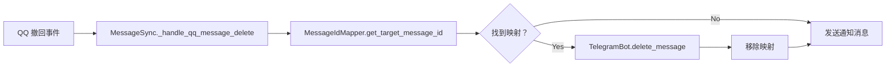

# 消息 ID 映射功能修复指南

## 📋 问题诊断

### 原始问题
用户反馈：虽然用户绑定和消息发送显示成功，但在实际进行消息撤回同步时，系统仍然无法找到对应的消息 ID 映射关系。

### 根本原因

1. **返回值类型错误**
   - `TelegramBot._direct_send_message()` 返回布尔值而非消息对象
   - `MessageSync._handle_qq_text_message()` 尝试访问 `success.message_id`（但 `success` 是布尔值）
   - 导致消息 ID 映射从未被正确建立

2. **缺少双向映射逻辑**
   - QQ → Telegram 方向：需要获取 Telegram 消息 ID
   - Telegram → QQ 方向：需要获取 QQ 消息 ID
   - 两个方向的映射都未能正确记录

3. **数据库持久化未充分利用**
   - 内存映射和数据库映射需要同步维护
   - 重启后内存映射丢失，但数据库中的映射仍然存在

## 🔧 修复方案

### 1. 修改 Telegram Bot 返回值

**文件**: `bots/telegram_bot.py`

```python
async def _direct_send_message(self, text: str, reply_to_message_id: Optional[int] = None, ...) -> Optional[Any]:
    """直接发送消息并返回消息对象"""
    try:
        # ... 发送逻辑
        sent_message = await self.bot.send_message(**send_kwargs)
        logger.debug(f"[Telegram] 消息发送成功，ID: {sent_message.message_id}")
        return sent_message  # 返回消息对象而非布尔值
    except Exception as e:
        logger.error(f"[Telegram] 直接发送消息失败：{e}")
        return None
```

### 2. 添加带返回值的新方法

**Telegram Bot**:
```python
async def send_message_with_result(self, text: str, reply_to_message_id: Optional[int] = None, **kwargs):
    """发送消息并返回消息对象"""
    sent_message = await self._direct_send_message(text, **kwargs)
    if sent_message:
        logger.debug(f"[Telegram] 消息发送成功：{text[:50]}... (ID: {sent_message.message_id})")
        return sent_message
    return None
```

**QQ Bot**:
```python
async def send_group_message_with_result(self, message: str, reply_to_message_id: Optional[int] = None):
    """发送群消息并返回结果字典"""
    # ... HTTP 请求逻辑
    if result.get('status') == 'ok':
        message_id = result.get('data', {}).get('message_id')
        return {
            'message_id': message_id,
            'status': 'ok'
        }
    return None
```

### 3. 完善消息 ID 映射逻辑

**QQ → Telegram 方向**:
```python
# core/message_sync.py - _handle_qq_text_message
sent_message = await self.telegram_bot.send_message_with_result(
    text=formatted_message,
    reply_to_message_id=reply_to_message_id
)

if sent_message:
    telegram_message_id = sent_message.message_id
    qq_message_id = message_data.get('message_id')
    
    # 添加映射
    success = await self.message_id_mapper.add_mapping(
        'qq', qq_message_id,
        'telegram', telegram_message_id
    )
    
    if success:
        logger.info(f"[ID 映射] QQ({qq_message_id}) → Telegram({telegram_message_id})")
```

**Telegram → QQ 方向**:
```python
# core/message_sync.py - _handle_telegram_text_message
send_result = await self.qq_bot.send_group_message_with_result(formatted_message)

if send_result:
    telegram_message_id = message_data.get('message_id')
    qq_message_id = send_result.get('message_id')
    
    # 添加映射
    success = await self.message_id_mapper.add_mapping(
        'telegram', telegram_message_id,
        'qq', qq_message_id
    )
    
    if success:
        logger.info(f"[ID 映射] Telegram({telegram_message_id}) → QQ({qq_message_id})")
```

### 4. 数据库持久化增强

确保每次添加内存映射的同时，也保存到数据库：

```python
# 内存映射
mapper.add_mapping('qq', qq_msg_id, 'telegram', tg_msg_id)

# 数据库持久化
db.save_message_mapping('qq', str(qq_msg_id), 'telegram', str(tg_msg_id))
```

## 📊 数据流程

### 消息发送流程（QQ → Telegram）


### 消息撤回流程（QQ → Telegram）



## ✅ 测试验证

### 运行测试脚本

```bash
python test_message_id_mapping.py
```

### 预期输出

```
📊 消息 ID 映射功能测试
==================================================

📋 测试目标:
1. 测试消息 ID 映射的添加
2. 测试消息 ID 映射的查询
3. 测试数据库持久化
4. 测试双向映射关系

🔧 初始化映射管理器
✅ 映射管理器和数据库管理器已就绪

📝 测试 1: 添加 QQ → Telegram 映射
✅ 映射添加成功：QQ(12345678) → Telegram(987654321)
✅ 数据库保存成功

🔍 测试 2: 查询映射关系
✅ 正向查询成功：QQ(12345678) → Telegram(987654321)
✅ 反向查询成功：Telegram(987654321) → QQ(12345678)

💾 测试 3: 数据库持久化查询
✅ 数据库查询成功：QQ(12345678) → Telegram(987654321)

📈 测试 5: 获取统计信息
内存映射统计:
  • 总映射数：2
  • 活跃映射数：2
  • 映射请求数：2
  • 成功映射数：2

数据库统计:
  • 用户绑定数：0
  • 消息映射数：2
  • 待处理验证码：0

✅ 消息 ID 映射功能测试完成!
```

## 🔍 调试技巧

### 1. 检查日志

查看消息 ID 映射相关日志：

```bash
grep "\[ID 映射\]" logs/*.log
```

正常情况应该看到：
```
[ID 映射] QQ(12345) → Telegram(67890)
[ID 映射] Telegram(67890) → QQ(12345)
```

### 2. 查询数据库

使用 SQLite 客户端查看映射表：

```sql
SELECT * FROM message_mappings;
```

### 3. 监控映射状态

在运行时查看映射统计：

```python
mapper_stats = mapper.get_stats()
db_stats = db.get_stats()

print(f"内存映射：{mapper_stats['active_mappings']}")
print(f"数据库映射：{db_stats['total_mappings']}")
```

## ⚠️ 注意事项

1. **映射有效期**
   - 默认 48 小时（与 Telegram 消息撤回限制一致）
   - 过期映射会自动清理

2. **消息 ID 类型**
   - QQ 消息 ID：整数
   - Telegram 消息 ID：整数
   - 存储时统一转换为字符串

3. **并发安全**
   - 数据库操作使用独立的连接
   - 内存操作是线程安全的

4. **重启恢复**
   - 内存映射在重启后会丢失
   - 数据库映射会持久化保存
   - 建议启动时从数据库加载活跃映射

## 🚀 下一步优化

- [ ] 启动时从数据库加载活跃映射到内存
- [ ] 添加映射缓存层提高查询性能
- [ ] 实现映射关系的批量操作
- [ ] 添加映射失效检测和自动修复
- [ ] 支持跨多群组的消息 ID 映射

---

*修复日期：2026-02-25*
*TQSync 项目文档*
