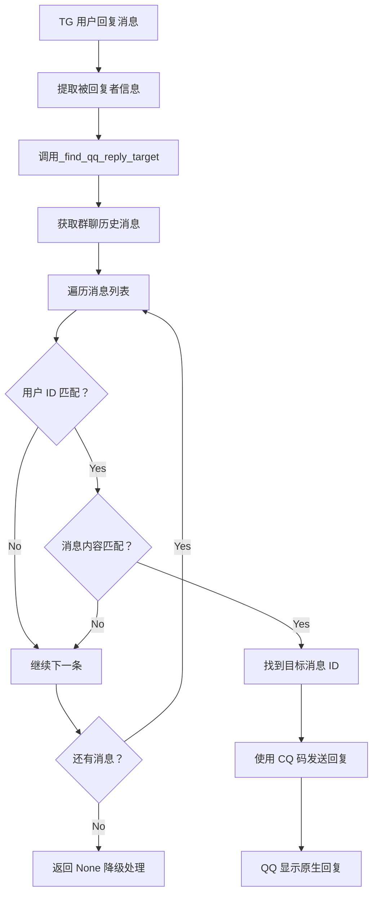

# QQ 回复目标查找功能实现

## 📋 功能概述

实现了 `_find_qq_reply_target()` 方法，用于在 Telegram 回复 QQ 消息时，精准找到对应的 QQ 消息 ID，从而实现原生回复功能。

## 🔧 实现方案

### 核心思路

通过 **NapCat API** 的 `get_group_msg_history` 接口获取群聊历史消息，然后根据被回复的用户信息和消息内容进行匹配，找到对应的 QQ 消息 ID。

### 技术细节

#### 1. **API 选择**

使用 NapCat 提供的标准 OneBot v11 API：

```http
POST /get_group_msg_history
Content-Type: application/json

{
  "group_id": 123456789,
  "count": 20
}
```

**API 文档**: [NapCat API - get_group_msg_history](https://napcat.apifox.cn/)

#### 2. **匹配策略**

采用 **用户 ID + 消息内容** 的双重匹配策略：

```python
user_match = (str(replied_to_user) == msg_user_id)
content_match = (replied_to_message and replied_to_message in msg_content)

if user_match and content_match:
    return msg_id  # 找到匹配的消息
```

#### 3. **搜索范围**

- 默认获取最近 **20 条** 群聊消息
- 从旧到新排序（`reversed(messages)`）
- 优先匹配最早的相关消息

## 💻 代码实现

### 完整代码

```python
async def _find_qq_reply_target(self, replied_to_user: Any, replied_to_message: Optional[str]) -> Optional[int]:
    """
    查找被回复的 QQ 消息 ID
    
    Args:
        replied_to_user: 被回复的用户信息
        replied_to_message: 被回复的消息内容
        
    Returns:
        int: QQ 消息 ID，如果找不到则返回 None
    """
    try:
        # 检查 QQ Bot 是否已初始化
        if not self.qq_bot or not self.qq_bot.session:
            logger.debug("QQ Bot 未初始化")
            return None
        
        logger.debug(f"查找 QQ 回复目标：用户={replied_to_user}, 消息={replied_to_message}")
        
        # 从最近的聊天记录中查找匹配的消息
        group_id = self.qq_bot.group_id
        
        try:
            url = f"{self.qq_bot.http_url}/get_group_msg_history"
            payload = {
                'group_id': int(group_id),
                'count': 20  # 获取最近 20 条消息
            }
            
            async with self.qq_bot.session.post(url, json=payload, 
                                              timeout=aiohttp.ClientTimeout(total=10)) as response:
                if response.status == 200:
                    result = await response.json()
                    if result.get('status') == 'ok':
                        messages = result.get('data', {}).get('messages', [])
                        
                        # 遍历历史消息，查找匹配的消息
                        for msg in reversed(messages):  # 从旧到新排序
                            msg_sender = msg.get('sender', {})
                            msg_user_id = str(msg_sender.get('user_id', ''))
                            msg_content = msg.get('raw_message', '')
                            msg_id = msg.get('message_id')
                            
                            # 检查是否匹配
                            user_match = (str(replied_to_user) == msg_user_id)
                            content_match = (replied_to_message and replied_to_message in msg_content)
                            
                            if user_match and content_match:
                                logger.info(f"找到匹配的 QQ 消息：ID={msg_id}")
                                return msg_id
                        
                        logger.warning(f"未在历史消息中找到匹配的消息")
                    else:
                        logger.error(f"获取群历史消息失败：{result}")
                else:
                    logger.error(f"HTTP 请求失败：{response.status}")
                    
        except Exception as e:
            logger.error(f"查询群历史消息时出错：{e}")
        
        # 如果无法通过历史消息找到，返回 None
        return None
        
    except Exception as e:
        logger.error(f"查找 QQ 回复目标时出错：{e}")
        return None
```

## 📊 工作流程

### Telegram → QQ 回复流程



## 🔍 日志示例

### 成功找到匹配

```
DEBUG | 查找 QQ 回复目标：用户=123456789, 消息=你好
INFO | 找到匹配的 QQ 消息：ID=987654321
INFO | [QQ] 使用原生回复功能，回复消息 ID: 987654321
```

### 未找到匹配

```
DEBUG | 查找 QQ 回复目标：用户=123456789, 消息=测试消息
WARNING | 未在历史消息中找到匹配的消息
INFO | [QQ] 未找到消息映射，使用文本格式
```

### API 调用失败

```
DEBUG | 查找 QQ 回复目标：用户=123456789, 消息=你好
ERROR | 获取群历史消息失败：{'status': 'failed', 'retcode': 100}
WARNING | 未在历史消息中找到匹配的消息
```

## ⚙️ 配置要求

### NapCat 配置

确保 NapCat 已启用以下 API：
- ✅ `get_group_msg_history` - 获取群历史消息
- ✅ WebSocket 反向连接正常

### 权限要求

- QQ机器人需要在目标群组中
- 机器人需要有查看历史消息的权限

## 🎯 优化建议

### 1. **增加搜索范围**

如果经常找不到匹配消息，可以增加搜索数量：

```python
payload = {
    'group_id': int(group_id),
    'count': 50  # 增加到 50 条
}
```

### 2. **添加缓存机制**

避免频繁调用 API：

```python
# 添加缓存
if hasattr(self, '_msg_history_cache'):
    cache_time, cache_messages = self._msg_history_cache
    if time.time() - cache_time < 60:  # 1 分钟缓存
        messages = cache_messages
    else:
        # 重新获取
```

### 3. **改进匹配算法**

支持模糊匹配：

```python
# 使用相似度匹配
from difflib import SequenceMatcher

def similarity(a, b):
    return SequenceMatcher(None, a, b).ratio()

content_similarity = similarity(replied_to_message, msg_content)
if content_similarity > 0.8:  # 80% 相似度
    return msg_id
```

## 🐛 故障排查

### 问题 1: 总是返回 None

**检查步骤**:
1. 确认 NapCat 服务正常运行
2. 检查 HTTP URL 配置正确
3. 查看日志中的 API 响应

**调试代码**:
```python
logger.debug(f"API 响应：{result}")
logger.debug(f"消息数量：{len(messages)}")
```

### 问题 2: 匹配到错误的消息

**可能原因**:
- 消息内容太短，容易重复
- 多个用户使用相同的昵称

**解决方案**:
```python
# 增加匹配条件
nickname_match = (sender_card == expected_nickname)
if user_match and content_match and nickname_match:
    return msg_id
```

### 问题 3: API 调用超时

**解决方案**:
```python
# 增加超时时间
timeout=aiohttp.ClientTimeout(total=30)  # 30 秒
```

## 📚 相关 API

### NapCat 消息相关 API

| API 端点 | 功能 | 用途 |
|---------|------|------|
| `/get_group_msg_history` | 获取群历史消息 | **本功能使用** |
| `/get_msg` | 获取指定消息 | 精确查询单条消息 |
| `/send_group_msg` | 发送群消息 | 发送回复 |
| `/delete_msg` | 撤回消息 | 删除消息 |

### 消息数据结构

```json
{
  "status": "ok",
  "retcode": 0,
  "data": {
    "messages": [
      {
        "message_id": 12345,
        "sender": {
          "user_id": 67890,
          "nickname": "张三",
          "card": "小李"
        },
        "raw_message": "你好世界",
        "message": "...",
        "time": 1234567890
      }
    ]
  }
}
```

## ✅ 测试验证

### 测试场景 1: 普通文本回复

```
TG 用户回复：[@QQ 用户 123] 你说得对
预期：找到 QQ 用户 123 发送的包含"你说得对"的消息
```

### 测试场景 2: 部分匹配

```
TG 用户回复：[@QQ 用户 456] 关于那个问题...
预期：找到 QQ 用户 456 发送的包含"那个问题"的消息
```

### 测试场景 3: 无匹配

```
TG 用户回复：[@不存在的用户] 测试
预期：返回 None，降级为文本格式
```

---

*实现日期：2026-02-25*
*TQSync 项目文档*
