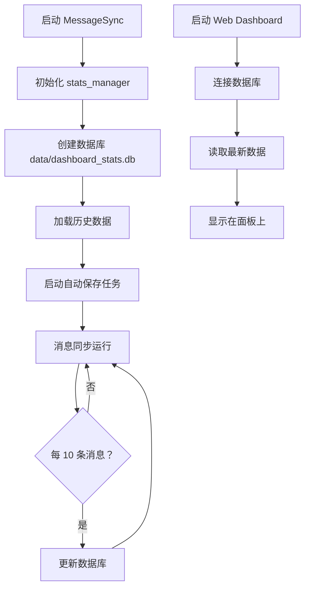

# 统计数据集成指南

## 📊 功能概述

已成功实现真实的统计数据集成，Web Dashboard 现在可以显示 MessageSync 的实际运行数据。

**完成时间**: 2026-02-25  
**版本**: v0.1.1

---

## ✅ 已完成的工作

### 1. **创建统计数据管理器**

**文件**: `utils/stats_manager.py`

**功能**:
- ✅ 异步数据库存储（SQLite）
- ✅ 每 10 秒自动保存
- ✅ 缓存机制提高性能
- ✅ 运行时间自动计算
- ✅ 崩溃后数据恢复

**数据库结构**:
```sql
CREATE TABLE stats (
    id INTEGER PRIMARY KEY CHECK (id = 1),
    telegram_received INTEGER DEFAULT 0,
    qq_received INTEGER DEFAULT 0,
    telegram_sent INTEGER DEFAULT 0,
    qq_sent INTEGER DEFAULT 0,
    filtered INTEGER DEFAULT 0,
    prefix_filtered INTEGER DEFAULT 0,
    commands_processed INTEGER DEFAULT 0,
    uptime TEXT DEFAULT '0h 0m',
    last_update REAL
)
```

### 2. **集成到 MessageSync**

**修改文件**: `core/message_sync.py`

**变更内容**:
```python
# 导入统计数据管理器
from utils.stats_manager import get_stats_manager

# 添加 stats_manager 属性
self.stats_manager = None

# 初始化时创建实例
self.stats_manager = await get_stats_manager()

# 定期更新统计数据（每 10 条消息）
if self.stats_manager and self.stats['telegram_received'] % 10 == 0:
    await self.stats_manager.update_stats(self.stats)
```

**更新时机**:
- Telegram 消息接收（每 10 条）
- QQ 消息接收（每 10 条）
- 程序正常关闭时

### 3. **Web Dashboard 读取真实数据**

**修改文件**: `web_dashboard/main.py`

**变更内容**:
```python
# 导入 stats_manager
try:
    from utils.stats_manager import get_stats_manager
    STATS_ENABLED = True
except ImportError:
    STATS_ENABLED = False

# API 接口读取真实数据
@app.get("/api/status")
async def get_status():
    if STATS_ENABLED:
        stats_manager = await get_stats_manager()
        stats = await stats_manager.get_stats()
        status_info["stats"] = stats
    else:
        # 使用默认数据
        status_info["stats"] = {...}
```

---

## 📦 依赖更新

### 新增依赖

**web_dashboard/requirements.txt**:
```txt
aiosqlite==0.19.0  # 新增
```

### 安装方法

```bash
cd web_dashboard
pip install -r requirements.txt
```

---

## 🔧 使用方法

### 启动流程



### 查看实时统计

1. **登录 Web Dashboard**
   ```
   http://localhost:8000
   ```

2. **查看统计看板**
   - Telegram 接收：实际接收的 Telegram 消息数
   - QQ 接收：实际接收的 QQ 消息数
   - Telegram 发送：实际发送到 Telegram 的消息数
   - QQ 发送：实际发送到 QQ 的消息数
   - 已过滤：被过滤规则拦截的消息数
   - 运行时间：从启动开始的累计时间

### 数据库位置

```
data/dashboard_stats.db
```

可以直接用 SQLite 工具查看：
```bash
sqlite3 data/dashboard_stats.db

SELECT * FROM stats;
```

---

## 📊 统计字段说明

| 字段 | 说明 | 更新时机 |
|------|------|----------|
| `telegram_received` | Telegram 接收数 | 收到 Telegram 消息 +1 |
| `qq_received` | QQ 接收数 | 收到 QQ 消息 +1 |
| `telegram_sent` | Telegram 发送数 | 成功发送到 Telegram +1 |
| `qq_sent` | QQ 发送数 | 成功发送到 QQ +1 |
| `filtered` | 过滤消息数 | 触发关键词过滤 +1 |
| `prefix_filtered` | 命令前缀过滤 | 触发前缀过滤 +1 |
| `commands_processed` | 处理命令数 | 处理!ping等命令 +1 |
| `uptime` | 运行时间 | 自动计算 |
| `last_update` | 最后更新时间 | 每次更新记录时间戳 |

---

## ⚙️ 配置选项

### 自动保存间隔

**默认**: 10 秒

修改 `utils/stats_manager.py`:
```python
async def _auto_save_task(self):
    while self.running:
        await asyncio.sleep(10)  # 修改此值
        await self._save_to_db()
```

### 更新频率

**默认**: 每 10 条消息更新一次

修改 `core/message_sync.py`:
```python
# 修改为每 N 条消息更新一次
if self.stats_manager and self.stats['telegram_received'] % 10 == 0:
    await self.stats_manager.update_stats(self.stats)
```

**建议**:
- 高频消息场景：设置为 50 或 100
- 低频消息场景：设置为 5 或 10

---

## 🔍 故障排查

### Q1: 统计数据始终为 0

**检查步骤**:

1. **确认 MessageSync 已启动**
   ```bash
   python main.py
   ```

2. **检查数据库文件**
   ```bash
   ls -la data/dashboard_stats.db
   ```

3. **查看日志**
   ```bash
   grep "stats" logs/bot.log
   ```

4. **验证导入**
   ```python
   python -c "from utils.stats_manager import get_stats_manager; print('OK')"
   ```

### Q2: Web Dashboard 无法获取数据

**可能原因**:

1. **MessageSync 未运行** - 先启动主程序
2. **数据库锁定** - 检查是否有其他进程占用
3. **路径错误** - 确认工作目录正确

**解决方案**:

```bash
# 重启 MessageSync
pkill -f "python main.py"
python main.py

# 重启 Web Dashboard
cd web_dashboard
python main.py
```

### Q3: 数据库文件损坏

**恢复方法**:

```bash
# 备份旧数据库
mv data/dashboard_stats.db data/dashboard_stats.db.bak

# 重启程序会自动创建新数据库
python main.py
```

---

## 📈 性能影响

### 资源占用

- **内存**: ~1MB（缓存数据）
- **CPU**: < 0.1%（异步非阻塞）
- **磁盘 IO**: 每 10 秒写入一次（约 1KB）
- **数据库大小**: ~8KB（单表）

### 性能优化

1. **批量更新** - 每 10 条消息更新一次，减少 IO
2. **异步操作** - 不阻塞消息处理
3. **内存缓存** - 优先读取缓存数据
4. **延迟计算** - 运行时间按需计算

---

## 🎯 扩展功能

### 历史记录查询

可以添加历史统计记录表：

```sql
CREATE TABLE stats_history (
    id INTEGER PRIMARY KEY AUTOINCREMENT,
    timestamp REAL,
    telegram_received INTEGER,
    qq_received INTEGER,
    ...
)
```

用于生成趋势图表。

### WebSocket 实时更新

通过 WebSocket 推送统计数据：

```python
@app.websocket("/ws/stats")
async def websocket_stats(websocket: WebSocket):
    await websocket.accept()
    while True:
        stats = await stats_manager.get_stats()
        await websocket.send_json(stats)
        await asyncio.sleep(5)
```

### 多实例支持

如果运行多个 MessageSync 实例：

```python
# 每个实例使用不同的 ID
INSERT OR REPLACE INTO stats (id, ...) 
VALUES (?, ?, ...)
```

---

## ✅ 验证清单

- [ ] MessageSync 正常运行
- [ ] Web Dashboard 可以登录
- [ ] 统计看板显示真实数字
- [ ] 数据库文件存在：`data/dashboard_stats.db`
- [ ] 日志无相关错误
- [ ] 发送测试消息后数字增加
- [ ] 重启后数据保留

---

## 📚 相关文件

- [`utils/stats_manager.py`](file://d:\TelegramSyncBot\utils\stats_manager.py) - 统计数据管理器
- [`core/message_sync.py`](file://d:\TelegramSyncBot\core\message_sync.py) - 消息同步核心
- [`web_dashboard/main.py`](file://d:\TelegramSyncBot\web_dashboard\main.py) - Web 后端

---

*更新日期：2026-02-25*  
*TQSync Team*  
*Version: v0.1.1*
